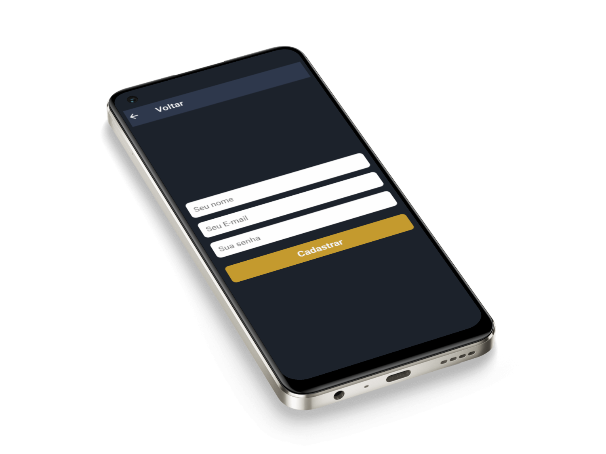
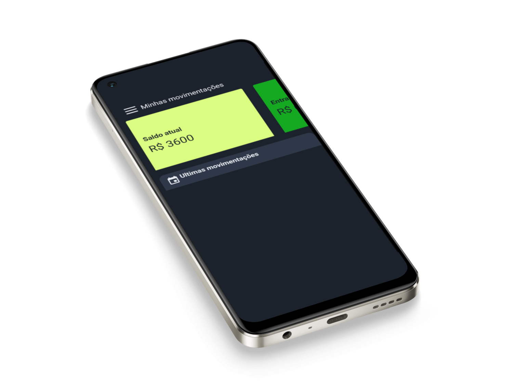
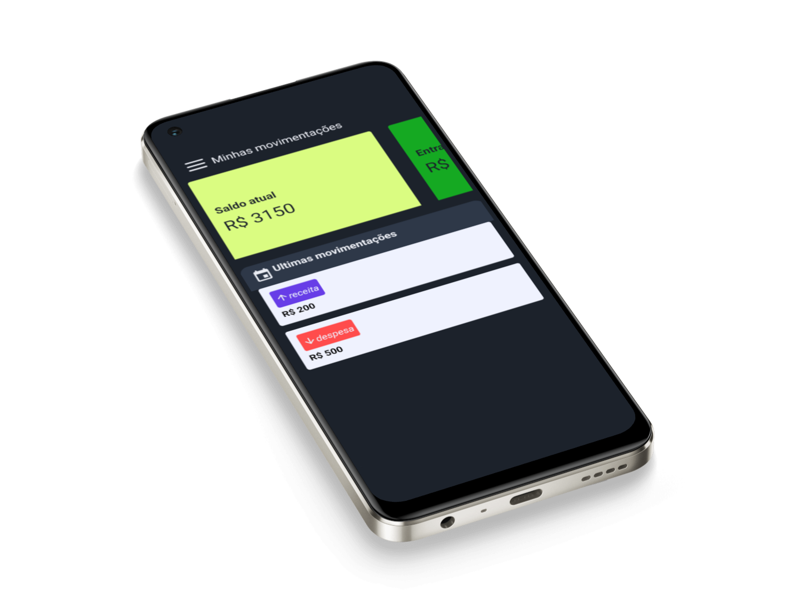
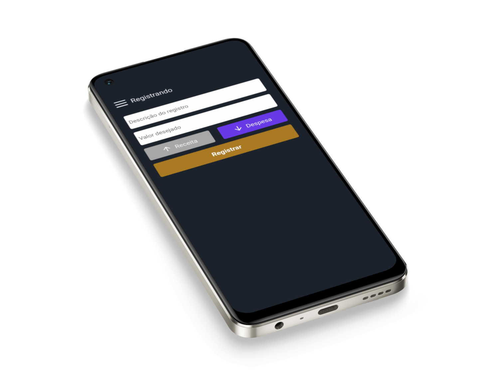
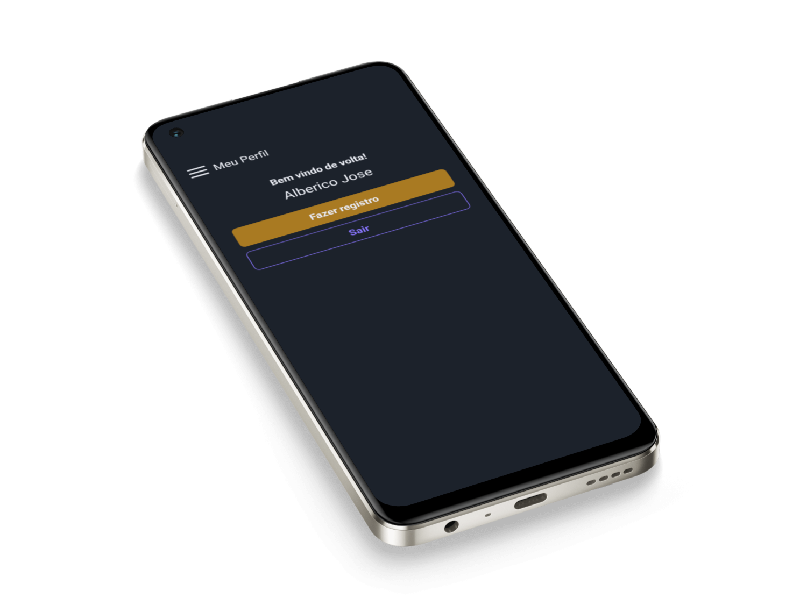

# 💰 GranaGo - Aplicativo de Gestão Financeira

GranaGo é um aplicativo móvel completo para gestão de finanças pessoais, desenvolvido com React Native e um backend robusto em Node.js.

## 📱 Sobre o Projeto

GranaGo permite aos usuários:

- Gerenciar receitas e despesas
- Visualizar saldo em tempo real
- Acompanhar histórico de transações
- Autenticação segura de usuários
- Interface intuitiva e responsiva

## 🛠️ Tecnologias Utilizadas

### Backend (`backend-financas/`)

- **Node.js** - Runtime JavaScript
- **Express.js** - Framework web
- **TypeScript** - Linguagem de programação tipada
- **Prisma** - ORM para banco de dados
- **SQLite** - Banco de dados
- **JWT** - Autenticação via tokens
- **bcryptjs** - Criptografia de senhas
- **CORS** - Cross-Origin Resource Sharing

### Mobile (`GranaGo-mobile/`)

- **React Native** - Framework mobile
- **Expo** - Plataforma de desenvolvimento
- **TypeScript** - Linguagem de programação tipada
- **React Navigation** - Navegação entre telas
- **Axios** - Cliente HTTP
- **AsyncStorage** - Armazenamento local
- **React Native Calendars** - Componente de calendário
- **Date-fns** - Manipulação de datas

## 📁 Estrutura do Projeto

```
GranaGo/
├── backend-financas/          # API Backend
│   ├── src/
│   │   ├── controllers/       # Controladores da API
│   │   ├── services/          # Lógica de negócio
│   │   ├── middlewares/       # Middlewares (autenticação)
│   │   ├── prisma/           # Configuração do banco
│   │   └── routes.ts         # Rotas da API
│   └── prisma/
│       └── schema.prisma     # Schema do banco de dados
└── GranaGo-mobile/           # Aplicativo Mobile
    ├── src/
    │   ├── components/       # Componentes reutilizáveis
    │   ├── pages/           # Telas do aplicativo
    │   ├── contexts/        # Contextos React
    │   ├── services/        # Serviços de API
    │   └── routes/          # Configuração de rotas
    └── assets/              # Imagens e recursos
```

## 🚀 Como Executar o Projeto

### Pré-requisitos

- Node.js (versão 16 ou superior)
- npm ou yarn
- Expo CLI (`npm install -g @expo/cli`)
- Git

### 1. Clone o repositório

```bash
git clone https://github.com/seu-usuario/GranaGo.git
cd GranaGo
```

### 2. Configuração do Backend

```bash
cd backend-financas

# Instalar dependências
npm install

# Configurar variáveis de ambiente
# Crie um arquivo .env na raiz do backend com:
# DATABASE_URL="file:./dev.db"

# Gerar cliente Prisma
npm run prisma:generate

# Executar migrações do banco
npm run prisma:migrate

# Iniciar servidor de desenvolvimento
npm run dev
```

O backend estará rodando em `http://localhost:3000`

### 3. Configuração do Mobile

```bash
cd GranaGo-mobile

# Instalar dependências
npm install

# Iniciar aplicativo
npx expo start
```

Após executar o comando, você verá um QR Code. Para testar:

- **Android**: Use o app Expo Go e escaneie o QR Code
- **iOS**: Use a câmera do iPhone e toque na notificação
- **Emulador**: Pressione `a` para Android ou `i` para iOS

## 📸 Screenshots

Login:

Cadastro:

Home:

Informação:

Drawer:

Registro:

Perfil:



## 🔧 Scripts Disponíveis

### Backend

```bash
npm run dev          # Inicia servidor de desenvolvimento
npm run build        # Compila o projeto
npm run start        # Inicia servidor de produção
npm run prisma:studio # Abre interface do Prisma Studio
```

### Mobile

```bash
npx expo start       # Inicia o servidor de desenvolvimento
npx expo build       # Gera build de produção
npx expo publish     # Publica no Expo
```

## 📊 Banco de Dados

O projeto utiliza SQLite com Prisma como ORM. As principais entidades são:

- **User**: Usuários do sistema
- **Receive**: Transações (receitas/despesas)

Para visualizar o banco de dados:

```bash
cd backend-financas
npm run prisma:studio
```

## 🔐 Autenticação

O sistema utiliza JWT (JSON Web Tokens) para autenticação. Os tokens são armazenados localmente no dispositivo móvel usando AsyncStorage.

## 📱 Funcionalidades Principais

- ✅ Cadastro e login de usuários
- ✅ Dashboard com saldo atual
- ✅ Adicionar receitas e despesas
- ✅ Histórico de transações
- ✅ Perfil do usuário
- ✅ Navegação por drawer

## 🤝 Contribuindo

1. Faça um fork do projeto
2. Crie uma branch para sua feature (`git checkout -b feature/AmazingFeature`)
3. Commit suas mudanças (`git commit -m 'Add some AmazingFeature'`)
4. Push para a branch (`git push origin feature/AmazingFeature`)
5. Abra um Pull Request

## 📄 Licença

Este projeto está sob a licença MIT. Veja o arquivo [LICENSE](LICENSE) para mais detalhes.

## 👨‍💻 Autor

**Seu Nome**

- GitHub: [Albérico Junior](https://github.com/AlbericoJr)
- LinkedIn: [Albérico Júnior](https://www.linkedin.com/in/alberico-junior/)

## 🙏 Agradecimentos

- Comunidade React Native
- Expo Team
- Prisma Team
- Todos os contribuidores

---

⭐ Se este projeto te ajudou, considere dar uma estrela no repositório!
